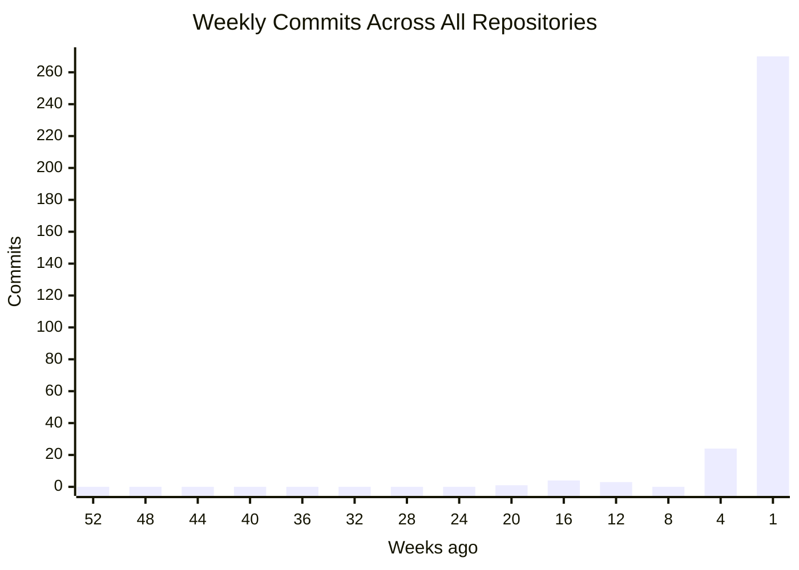
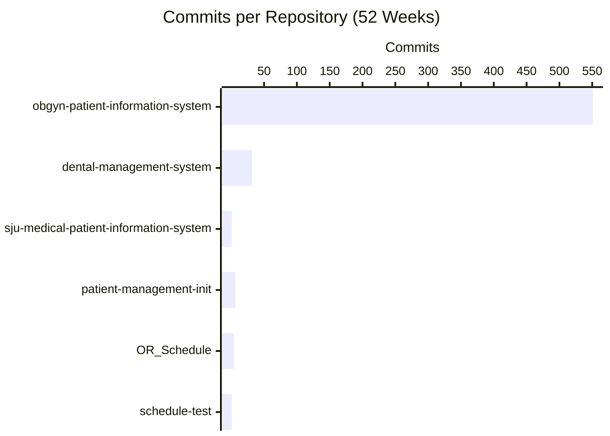
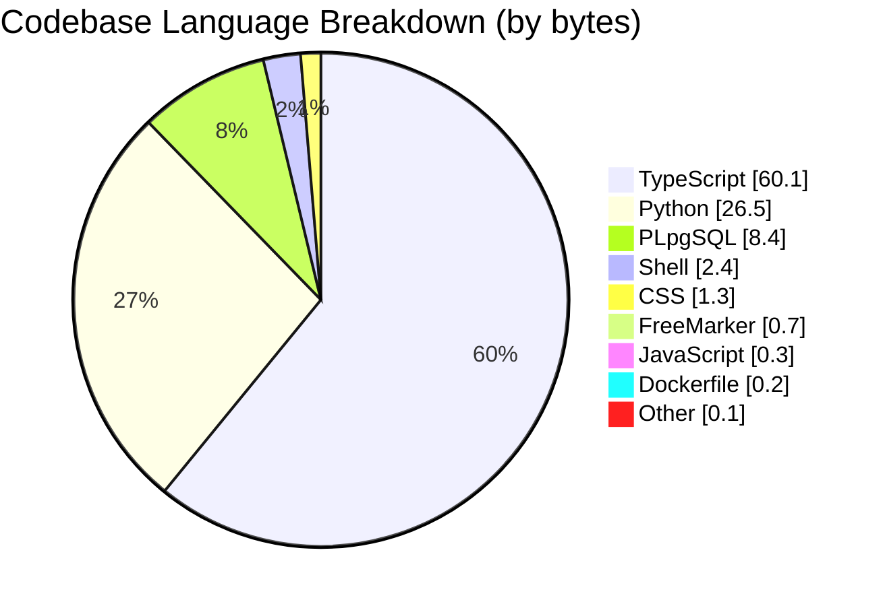
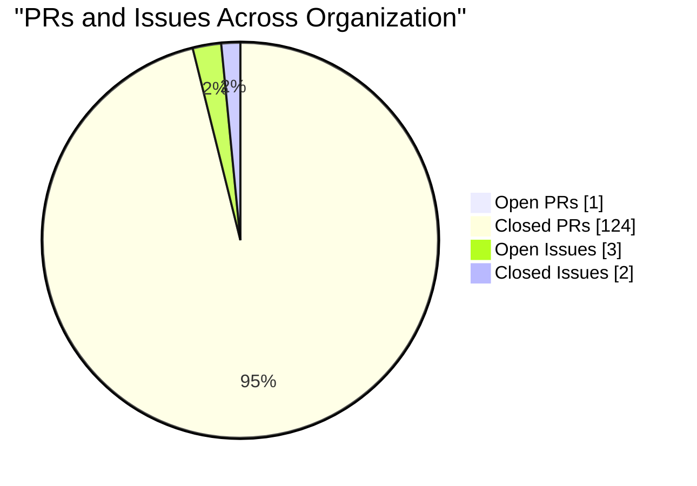

## Repository Overview

| Repository | Status | Language | Commits | Latest Commit | Author | Last Push |
|------------|--------|----------|---------|---------------|--------|-----------|
| **obgyn-patient-information-system** Hospital Information System — internal docs at csth-... |  | TypeScript | 566 | `6e26890` Add classic WHO-style partogram workflow (... | Melkor | 32m ago |
| **dental-management-system** |  | TypeScript | 32 | `307cbc1` Update issue templates | Melkor | 19h ago |
| **sju-medical-patient-information-system** |  | n/a | 1 | `25c1ac8` Update issue templates | Melkor | 3d ago |
| **patient-management-init** |  | Python | 6 | `1a3a4a7` Daily_scheduling_full_implementation | CheDil | 4w ago |
| **OR_Schedule** For kalubowila project |  | Python | 4 | `1d2643a` Bug fixes | chamatka2002 | 2mo ago |
| **schedule-test** |  | n/a | 1 | `deb0dc1` Initial commit | MelKor | 4mo ago |

---

## Commit Activity (Last 52 Weeks)

| Repository | Commits (52w) | Frequency |
|------------|---------------|-----------|
| **obgyn-patient-information-system** | 551 | Very Active |
| **dental-management-system** | 32 | Occasional |
| **sju-medical-patient-information-system** | 1 | Low |
| **patient-management-init** | 6 | Low |
| **OR_Schedule** | 4 | Low |
| **schedule-test** | 1 | Low |

---

## Organization Summary

| Metric | Count |
|--------|-------|
| Repositories | 6 |
| Active (last 7 days) | 3 |
| Total Commits | 610 |
| Open Pull Requests | 1 |
| Merged/Closed Pull Requests | 124 |
| Open Issues | 3 |
| Closed Issues | 2 |
| Security Alerts | 1 |
| Contributors | 6 |
| Languages | TypeScript, Python, PLpgSQL, Shell, CSS, FreeMarker, JavaScript, Dockerfile, +3 more |
| Last Updated | April 30, 2026 at 01:29 UTC |

---

## Language Distribution

---

## Pull Requests and Issues

| Repository | PRs (Open) | PRs (Closed) | Issues (Open) | Issues (Closed) | Security Alerts |
|------------|------------|--------------|---------------|-----------------|-----------------|
| **obgyn-patient-information-system** | 0 | 120 | 1 | 1 | **1** |
| **dental-management-system** | 1 | 4 | 1 | 1 | 0 |
| **sju-medical-patient-information-system** | 0 | 0 | 1 | 0 | 0 |
| **patient-management-init** | 0 | 0 | 0 | 0 | 0 |
| **OR_Schedule** | 0 | 0 | 0 | 0 | 0 |
| **schedule-test** | 0 | 0 | 0 | 0 | 0 |

---

## Per-Repository Language Breakdown

**obgyn-patient-information-system**:       
**dental-management-system**:     
**patient-management-init**:   
**OR_Schedule**:   

---

Auto-generated on April 30, 2026 at 01:29 UTC.
Updates automatically on every push, PR, issue, or security event across all organization repositories.

