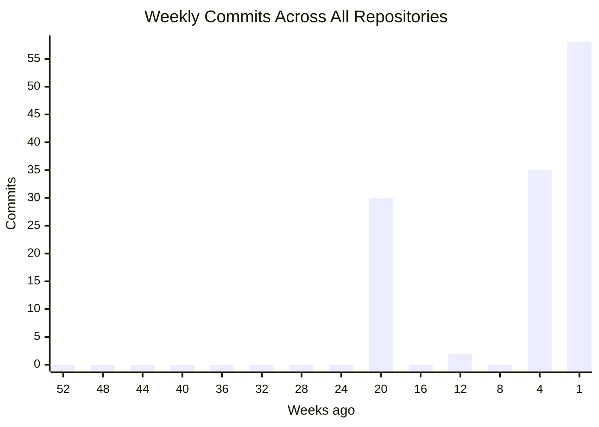

# Colombo South Teaching Hospital — Projects

**Student-led software development | University of Sri Jayewardenepura**
**Building digital solutions for Colombo South Teaching Hospital, Kalubowila, Sri Lanka**

    

---

## Organization Summary

| Metric | Count |
|--------|-------|
| Repositories | 5 |
| Active (last 7 days) | 2 |
| Total Commits | 0 |
| Open Pull Requests | 0 |
| Merged/Closed Pull Requests | 0 |
| Open Issues | 0 |
| Closed Issues | 0 |
| Security Alerts | 0 |
| Contributors | 4 |
| Languages | TypeScript, Python, PLpgSQL, Shell, CSS, FreeMarker, Dockerfile, JavaScript, +1 more |
| Last Updated | April 19, 2026 at 10:34 UTC |

---

## Language Distribution

---

## Repository Overview

| Repository | Status | Language | Commits | Latest Commit | Author | Last Push |
|------------|--------|----------|---------|---------------|--------|-----------|
| **obgyn-patient-information-system** |  | TypeScript | 0 | n/a | n/a | 3h ago |
| **dental-management-system** |  | TypeScript | 0 | n/a | n/a | 6d ago |
| **patient-management-init** |  | Python | 0 | n/a | n/a | 2w ago |
| **OR_Schedule** For kalubowila project |  | Python | 0 | n/a | n/a | 2mo ago |
| **schedule-test** |  | n/a | 0 | n/a | n/a | 3mo ago |

---

## Commit Activity (Last 52 Weeks)

| Repository | Commits (52w) | Frequency | Activity |
|------------|---------------|-----------|----------|
| **obgyn-patient-information-system** | 229 | Steady | `####################` |
| **dental-management-system** | 31 | Occasional | `##..................` |
| **patient-management-init** | 6 | Low | `....................` |
| **OR_Schedule** | 4 | Low | `....................` |
| **schedule-test** | 1 | Low | `....................` |

---

## Pull Requests and Issues

| Repository | PRs (Open) | PRs (Closed) | Issues (Open) | Issues (Closed) | Security Alerts |
|------------|------------|--------------|---------------|-----------------|-----------------|
| **obgyn-patient-information-system** | 0 | 0 | 0 | 0 | 0 |
| **dental-management-system** | 0 | 0 | 0 | 0 | 0 |
| **patient-management-init** | 0 | 0 | 0 | 0 | 0 |
| **OR_Schedule** | 0 | 0 | 0 | 0 | 0 |
| **schedule-test** | 0 | 0 | 0 | 0 | 0 |

---

## Top Contributors

| Rank | Contributor | Contributions | Activity |
|------|-------------|---------------|----------|
| 1 | `WWI2196` | 261 | `####################` |
| 2 | `CheDil` | 12 | `....................` |
| 3 | `chamatka2002` | 4 | `....................` |
| 4 | `dependabot[bot]` | 1 | `....................` |

---

## Per-Repository Language Breakdown

**obgyn-patient-information-system**:       
**dental-management-system**:     
**patient-management-init**:   
**OR_Schedule**:   

---

Auto-generated on April 19, 2026 at 10:34 UTC.
Updates automatically on every push, PR, issue, or security event across all organization repositories.

