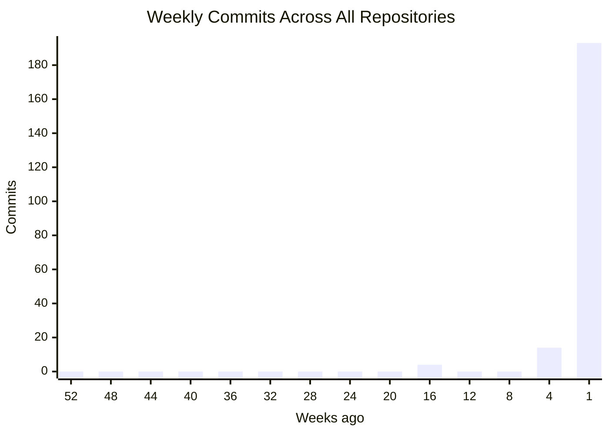
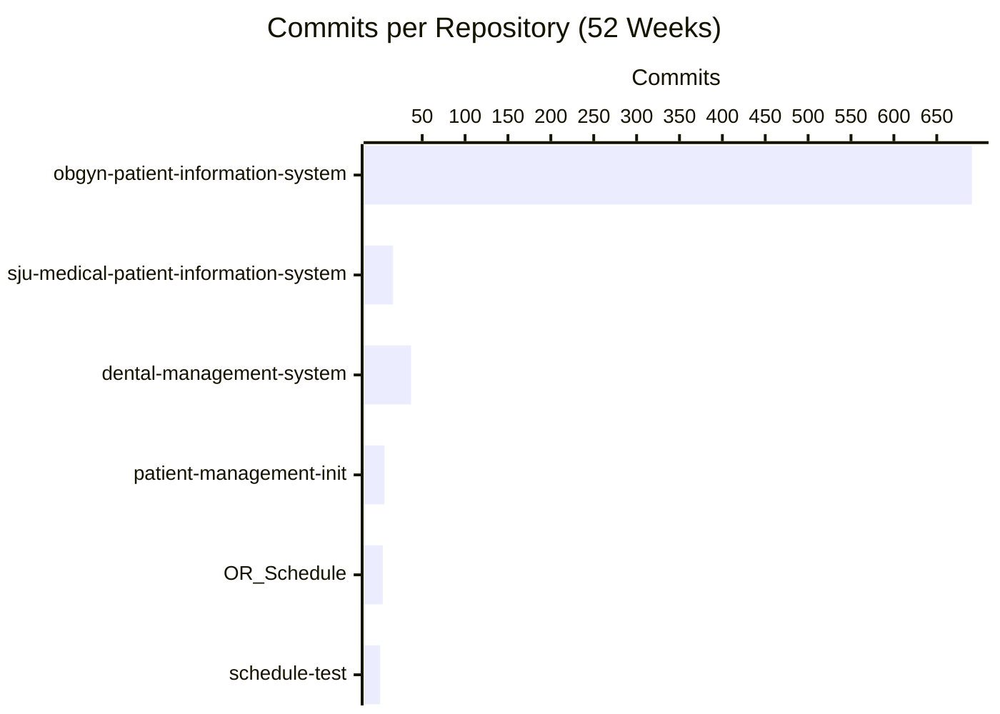
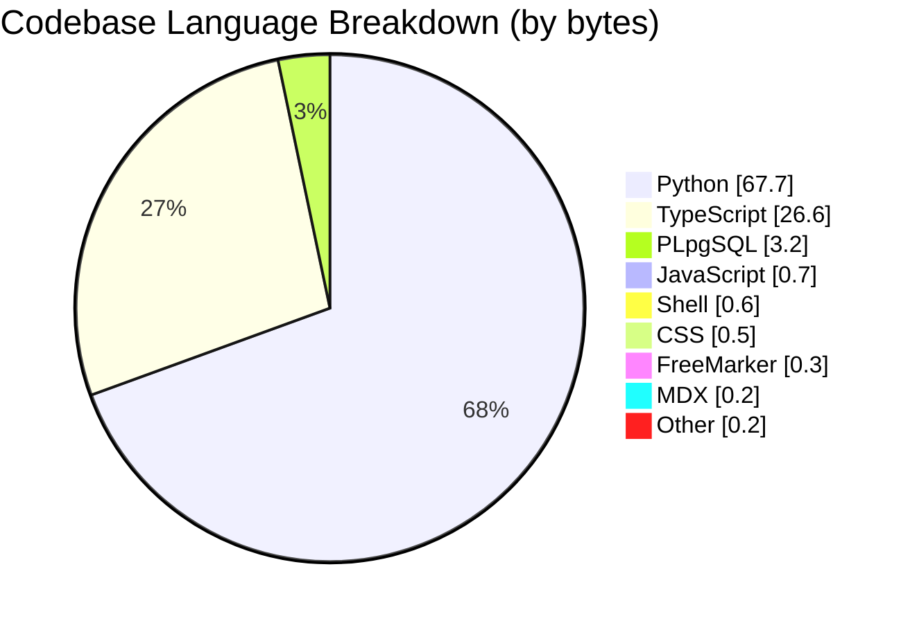
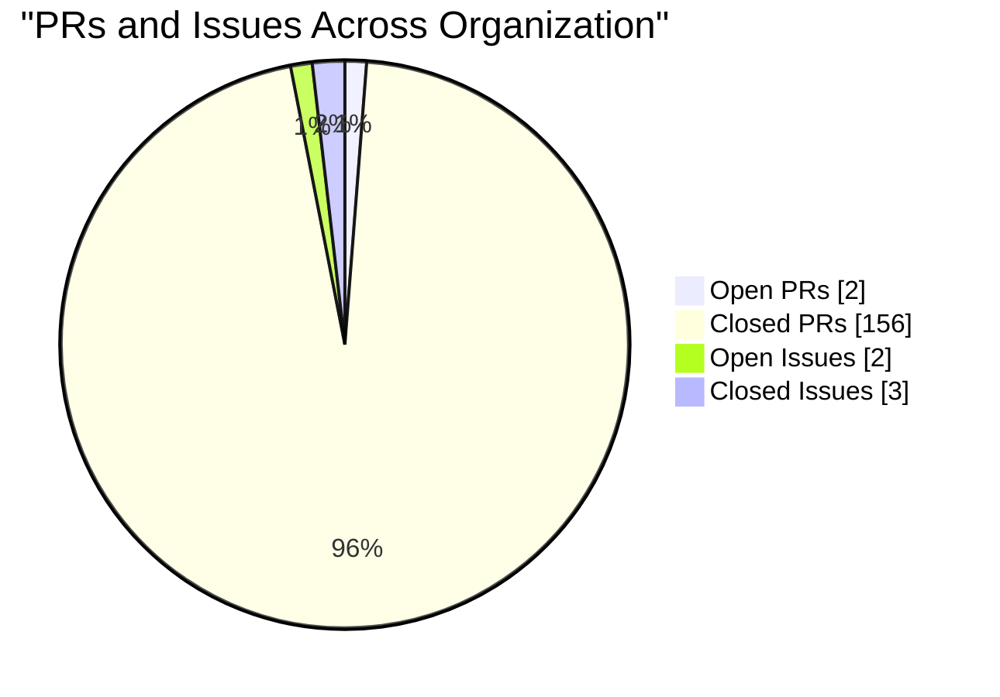

## Repository Overview

| Repository | Status | Language | Commits | Latest Commit | Author | Last Push |
|------------|--------|----------|---------|---------------|--------|-----------|
| **obgyn-patient-information-system** Hospital Information System — internal docs at csth-... |  | TypeScript | 692 | `67dc7bf` Merge pull request #156 from CSTH-Projects... | Melkor | 2h ago |
| **sju-medical-patient-information-system** |  | Python | 16 | `ecfe151` Merge pull request #6 from CSTH-Projects/d... | Melkor | 2d ago |
| **dental-management-system** |  | TypeScript | 37 | `1234808` Merge pull request #6 from CSTH-Projects/E... | Melkor | 5d ago |
| **patient-management-init** |  | Python | 6 | `1a3a4a7` Daily_scheduling_full_implementation | CheDil | 1mo ago |
| **OR_Schedule** For kalubowila project |  | Python | 4 | `1d2643a` Bug fixes | chamatka2002 | 2mo ago |
| **schedule-test** |  | n/a | 1 | `deb0dc1` Initial commit | MelKor | 4mo ago |

---

## Commit Activity (Last 52 Weeks)

| Repository | Commits (52w) | Frequency |
|------------|---------------|-----------|
| **obgyn-patient-information-system** | 691 | Very Active |
| **sju-medical-patient-information-system** | 16 | Low |
| **dental-management-system** | 37 | Occasional |
| **patient-management-init** | 6 | Low |
| **OR_Schedule** | 4 | Low |
| **schedule-test** | 1 | Low |

---

## Organization Summary

| Metric | Count |
|--------|-------|
| Repositories | 6 |
| Active (last 7 days) | 3 |
| Total Commits | 756 |
| Open Pull Requests | 2 |
| Merged/Closed Pull Requests | 156 |
| Open Issues | 2 |
| Closed Issues | 3 |
| Security Alerts | 3 |
| Contributors | 6 |
| Languages | Python, TypeScript, PLpgSQL, JavaScript, Shell, CSS, FreeMarker, MDX, +5 more |
| Last Updated | May 06, 2026 at 19:07 UTC |

---

## Language Distribution

---

## Pull Requests and Issues

| Repository | PRs (Open) | PRs (Closed) | Issues (Open) | Issues (Closed) | Security Alerts |
|------------|------------|--------------|---------------|-----------------|-----------------|
| **obgyn-patient-information-system** | 1 | 146 | 1 | 1 | **1** |
| **sju-medical-patient-information-system** | 1 | 5 | 1 | 1 | **1** |
| **dental-management-system** | 0 | 5 | 0 | 1 | **1** |
| **patient-management-init** | 0 | 0 | 0 | 0 | 0 |
| **OR_Schedule** | 0 | 0 | 0 | 0 | 0 |
| **schedule-test** | 0 | 0 | 0 | 0 | 0 |

---

## Per-Repository Language Breakdown

**obgyn-patient-information-system**:       
**sju-medical-patient-information-system**:       
**dental-management-system**:     
**patient-management-init**:   
**OR_Schedule**:   

---

Auto-generated on May 06, 2026 at 19:07 UTC.
Updates automatically on every push, PR, issue, or security event across all organization repositories.

