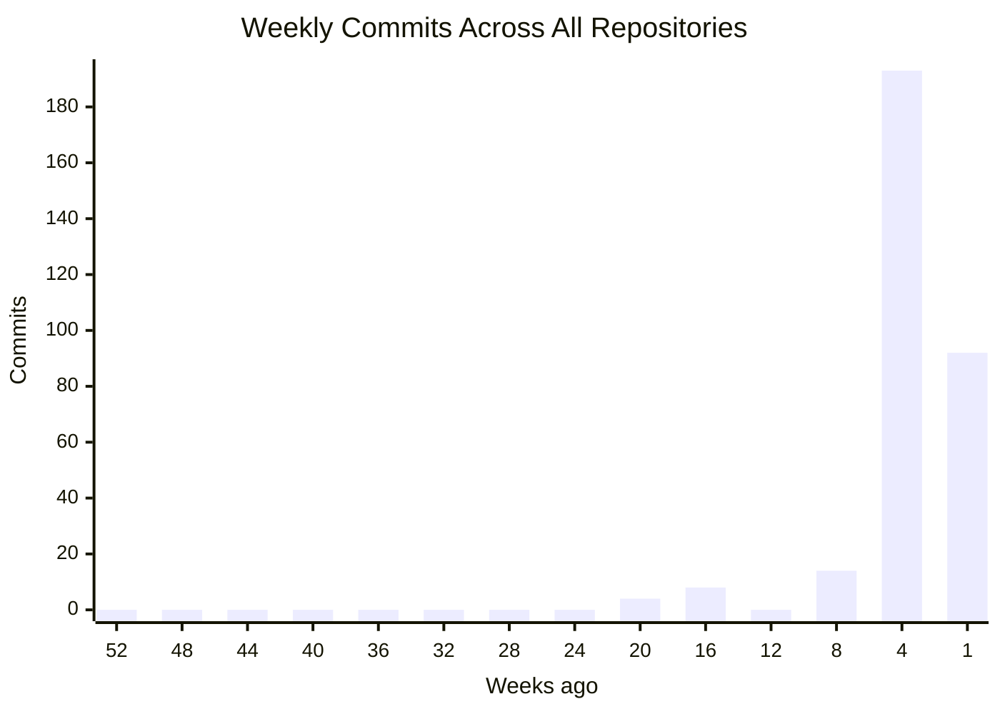
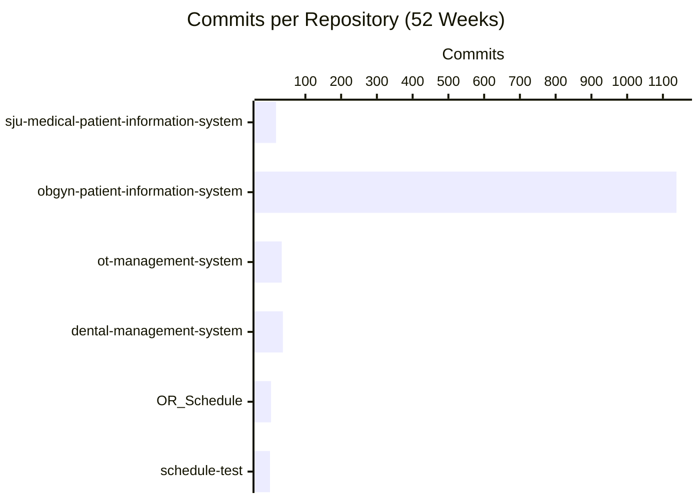
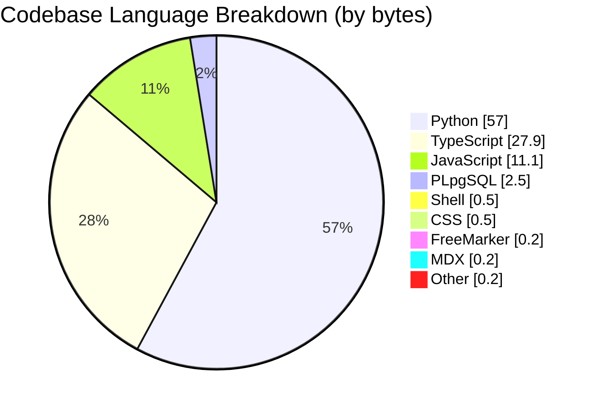
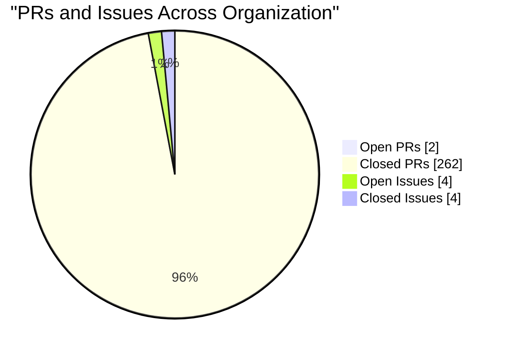

## Repository Overview

| Repository | Status | Language | Commits | Latest Commit | Author | Last Push |
|------------|--------|----------|---------|---------------|--------|-----------|
| **sju-medical-patient-information-system** |  | Python | 18 | `5be213d` Merge pull request #7 from CSTH-Projects/d... | Wansajee | 12h ago |
| **obgyn-patient-information-system** Hospital Information System — internal docs at csth-... |  | TypeScript | 1,138 | `a52ffab` Merge pull request #268 from CSTH-Projects... | Wansajee | yesterday |
| **ot-management-system** |  | Python | 34 | `c0d6336` Merge pull request #2 from CSTH-Projects/d... | Wansajee | 2d ago |
| **dental-management-system** |  | TypeScript | 37 | `1234808` Merge pull request #6 from CSTH-Projects/E... | Melkor | 3w ago |
| **OR_Schedule** For kalubowila project |  | Python | 4 | `1d2643a` Bug fixes | chamatka2002 | 3mo ago |
| **schedule-test** |  | n/a | 1 | `deb0dc1` Initial commit | MelKor | 5mo ago |

---

## Commit Activity (Last 52 Weeks)

| Repository | Commits (52w) | Frequency |
|------------|---------------|-----------|
| **sju-medical-patient-information-system** | 18 | Low |
| **obgyn-patient-information-system** | 1138 | Very Active |
| **ot-management-system** | 34 | Occasional |
| **dental-management-system** | 37 | Occasional |
| **OR_Schedule** | 4 | Low |
| **schedule-test** | 1 | Low |

---

## Organization Summary

| Metric | Count |
|--------|-------|
| Repositories | 6 |
| Active (last 7 days) | 3 |
| Total Commits | 1,232 |
| Open Pull Requests | 2 |
| Merged/Closed Pull Requests | 262 |
| Open Issues | 4 |
| Closed Issues | 4 |
| Security Alerts | 4 |
| Contributors | 6 |
| Languages | Python, TypeScript, JavaScript, PLpgSQL, Shell, CSS, FreeMarker, MDX, +5 more |
| Last Updated | June 02, 2026 at 15:50 UTC |

---

## Language Distribution

---

## Pull Requests and Issues

| Repository | PRs (Open) | PRs (Closed) | Issues (Open) | Issues (Closed) | Security Alerts |
|------------|------------|--------------|---------------|-----------------|-----------------|
| **sju-medical-patient-information-system** | 0 | 8 | 1 | 1 | **1** |
| **obgyn-patient-information-system** | 0 | 247 | 1 | 1 | **1** |
| **ot-management-system** | 1 | 2 | 1 | 1 | **1** |
| **dental-management-system** | 1 | 5 | 1 | 1 | **1** |
| **OR_Schedule** | 0 | 0 | 0 | 0 | 0 |
| **schedule-test** | 0 | 0 | 0 | 0 | 0 |

---

## Per-Repository Language Breakdown

**sju-medical-patient-information-system**:       
**obgyn-patient-information-system**:       
**ot-management-system**:       
**dental-management-system**:     
**OR_Schedule**:   

---

Auto-generated on June 02, 2026 at 15:50 UTC.
Updates automatically on every push, PR, issue, or security event across all organization repositories.

