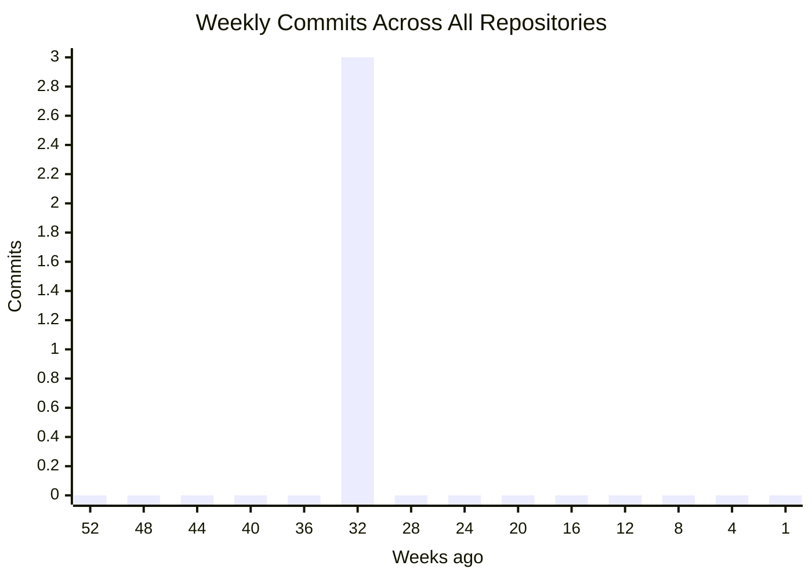
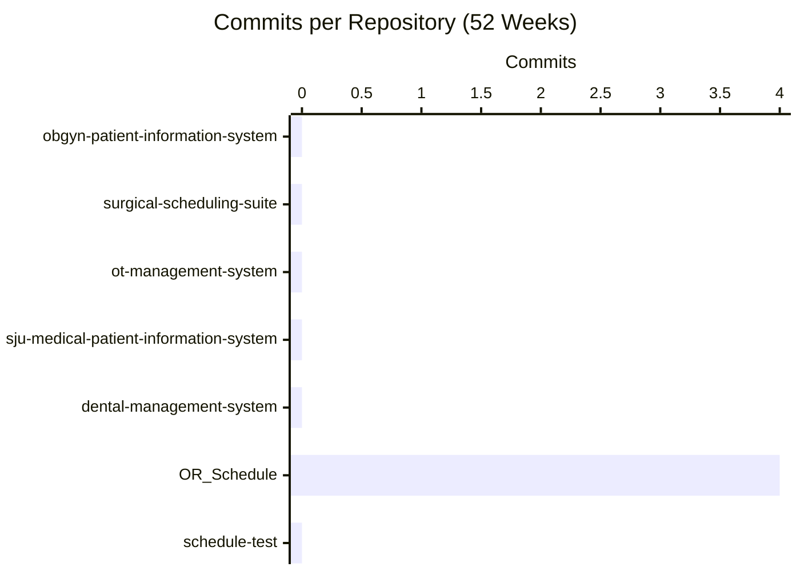
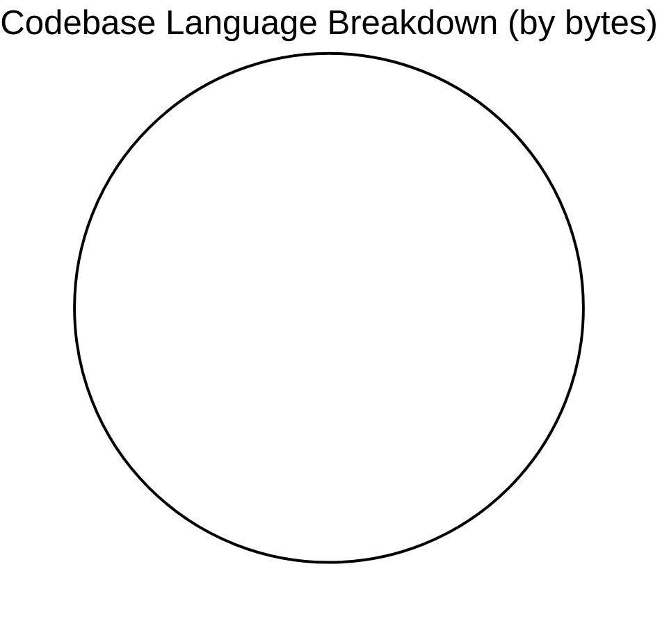
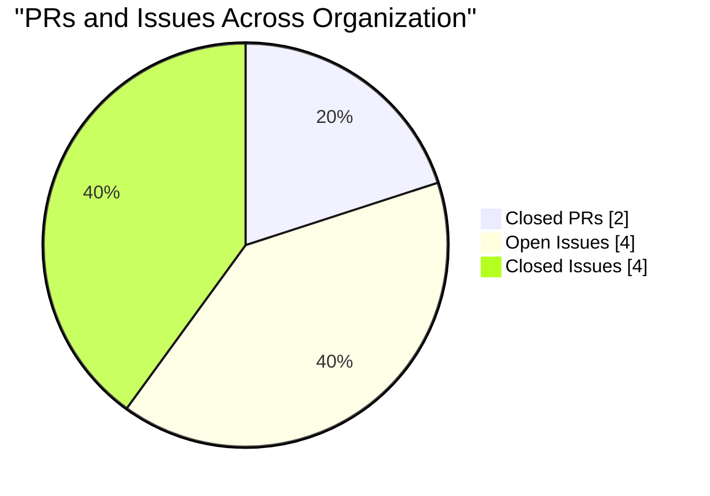

## Repository Overview

| Repository | Status | Language | Commits | Latest Commit | Author | Last Push |
|------------|--------|----------|---------|---------------|--------|-----------|
| **obgyn-patient-information-system** Hospital Information System — internal docs at csth-... |  | TypeScript | 0 | n/a | n/a | 13h ago |
| **surgical-scheduling-suite** An application for reserving, scheduling, and managi... |  | n/a | 0 | n/a | n/a | 2w ago |
| **ot-management-system** |  | Python | 0 | n/a | n/a | 2mo ago |
| **sju-medical-patient-information-system** |  | Python | 0 | n/a | n/a | 2mo ago |
| **dental-management-system** |  | TypeScript | 0 | n/a | n/a | 3mo ago |
| **OR_Schedule** For kalubowila project |  | Python | 0 | n/a | n/a | 6mo ago |
| **schedule-test** |  | n/a | 0 | n/a | n/a | 7mo ago |

---

## Commit Activity (Last 52 Weeks)

```mermaid
xychart-beta
    title "Weekly Commits Across All Repositories"
    x-axis "Weeks ago" [52, 48, 44, 40, 36, 32, 28, 24, 20, 16, 12, 8, 4, 1]
    y-axis "Commits"
    bar [0, 0, 0, 0, 0, 3, 0, 0, 0, 0, 0, 0, 0, 0]
```

```mermaid
xychart-beta horizontal
    title "Commits per Repository (52 Weeks)"
    x-axis ["obgyn-patient-information-system", "surgical-scheduling-suite", "ot-management-system", "sju-medical-patient-information-system", "dental-management-system", "OR_Schedule", "schedule-test"]
    y-axis "Commits"
    bar [0, 0, 0, 0, 0, 4, 0]
```

| Repository | Commits (52w) | Frequency |
|------------|---------------|-----------|
| **obgyn-patient-information-system** | 0 | None |
| **surgical-scheduling-suite** | 0 | None |
| **ot-management-system** | 0 | None |
| **sju-medical-patient-information-system** | 0 | None |
| **dental-management-system** | 0 | None |
| **OR_Schedule** | 4 | Low |
| **schedule-test** | 0 | None |

---

## Organization Summary

| Metric | Count |
|--------|-------|
| Repositories | 7 |
| Active (last 7 days) | 1 |
| Total Commits | 0 |
| Open Pull Requests | 0 |
| Merged/Closed Pull Requests | 2 |
| Open Issues | 4 |
| Closed Issues | 4 |
| Security Alerts | 4 |
| Contributors | 1 |
| Languages |  |
| Last Updated | August 17, 2026 at 14:19 UTC |

---

## Language Distribution

```mermaid
pie showData
    title Codebase Language Breakdown (by bytes)
```

---

## Pull Requests and Issues

| Repository | PRs (Open) | PRs (Closed) | Issues (Open) | Issues (Closed) | Security Alerts |
|------------|------------|--------------|---------------|-----------------|-----------------|
| **obgyn-patient-information-system** | 0 | 0 | 1 | 1 | **1** |
| **surgical-scheduling-suite** | 0 | 0 | 0 | 0 | 0 |
| **ot-management-system** | 0 | 2 | 1 | 1 | **1** |
| **sju-medical-patient-information-system** | 0 | 0 | 1 | 1 | **1** |
| **dental-management-system** | 0 | 0 | 1 | 1 | **1** |
| **OR_Schedule** | 0 | 0 | 0 | 0 | 0 |
| **schedule-test** | 0 | 0 | 0 | 0 | 0 |

```mermaid
pie showData
    title "PRs and Issues Across Organization"
    "Closed PRs" : 2
    "Open Issues" : 4
    "Closed Issues" : 4
```

---

## Per-Repository Language Breakdown

---

Auto-generated on August 17, 2026 at 14:19 UTC.
Updates automatically on every push, PR, issue, or security event across all organization repositories.

